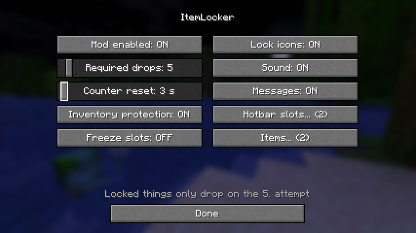
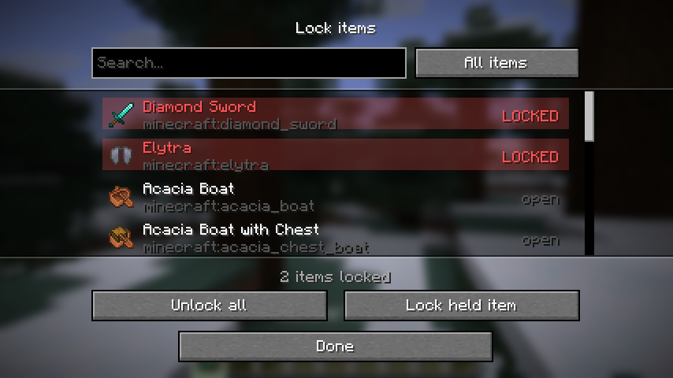
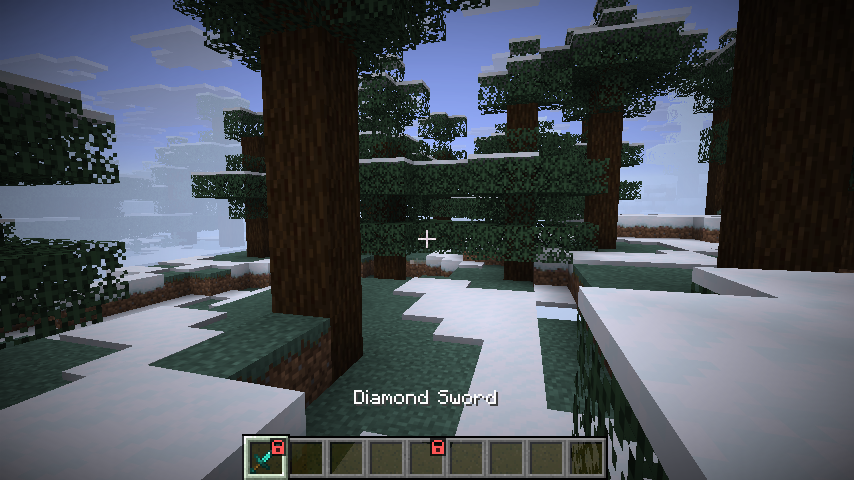

# ItemLocker

Eine clientseitige Fabric-Mod für **Minecraft 1.21.11**, die verhindert, dass du aus Versehen wichtige Items wegwirfst.

Du sperrst einzelne **Hotbar-Slots** oder ganze **Item-Typen**. Ein gesperrtes Item fällt nicht beim ersten Druck auf die Drop-Taste, sondern erst, wenn du sie **5-mal hintereinander** drückst (Anzahl frei einstellbar, 1–64).

---

## Features

- 🔒 **Hotbar-Slots sperren** – Slot 1–9 einzeln, egal was drin liegt
- 🗡️ **Item-Typen sperren** – z. B. `minecraft:elytra` ist überall geschützt
- 🖥️ **Config-Menü** – alles per Maus einstellbar, inkl. durchsuchbarer Item-Liste (mit [Mod Menu](https://modrinth.com/mod/modmenu) oder ohne)
- 🔁 **Mehrfach-Drop** – gesperrte Items fallen erst nach *N* Versuchen (Standard: 5)
- 📦 **Auch im Inventar** – `Q` auf einem Slot und das Rauswerfen des Stacks am Cursor sind ebenfalls geschützt
- 🧊 **Slot-Inhalt bleibt drin** – der Inhalt eines gesperrten Slots lässt sich im Inventar nicht herausziehen (abschaltbar)
- 👀 **HUD-Anzeige** – kleines Schloss auf gesperrten Slots plus Fortschrittsbalken beim Droppen
- ⌨️ **Tasten & Commands** – alles ohne Datei-Editieren einstellbar
- 🌍 Deutsch und Englisch

Die Mod ist **rein clientseitig**. Der Server bekommt einen geblockten Drop nie zu sehen, weil das Paket gar nicht erst rausgeht – funktioniert also auch auf Servern, die keine Mods erlauben.

---

## Installation

### Normaler Fabric-Launcher

1. [Fabric Loader](https://fabricmc.net/use/installer/) für **1.21.11** installieren
2. [Fabric API](https://modrinth.com/mod/fabric-api) (Version für 1.21.11) in den `mods`-Ordner legen
3. `itemlocker-1.1.0.jar` daneben legen
4. Optional: [Mod Menu](https://modrinth.com/mod/modmenu) für den Zahnrad-Knopf im Mod-Menü
4. Minecraft mit dem Fabric-Profil starten

### Lunar Client

Lunar Client lädt Fabric-Mods aus einem eigenen Ordner:

```
%USERPROFILE%\.lunarclient\mods\1.21.11
```

Dort **beide** Jars ablegen — `itemlocker-*.jar` **und** `fabric-api-*.jar` für 1.21.11. Danach Lunar neu starten und die Mod unter *Settings → Mods* aktivieren.

> **Hinweis:** Lunar Client bringt kein Fabric API mit. Ohne Fabric API startet die Mod nicht.
> Falls Lunar noch kein 1.21.11 anbietet, passe `minecraft_version`, `yarn_mappings` und `fabric_version` in [`gradle.properties`](gradle.properties) auf die von Lunar unterstützte Version an und baue neu.

---

## Bedienung

### Config-Menü

Drei Wege dorthin:

1. **Mod Menu** – im Mod-Menü auf ItemLocker → Zahnrad
2. **Command** – `/itemlocker config`
3. **Taste** – „ItemLocker-Menü öffnen" in den Steuerungs-Einstellungen belegen

Mod Menu ist **optional**: ohne funktionieren Command und Taste trotzdem.



Im Hauptmenü stellst du alle Optionen per Maus ein (Mod an/aus, nötige Drops als Schieberegler, Sound, Meldungen, HUD …). Dazu zwei Unterseiten:

- **Hotbar-Slots …** – die neun Slots als anklickbare Reihe, inklusive Vorschau, was gerade drinliegt
- **Items … (N)** – durchsuchbare Liste aller Items. Tippe z. B. `elytra`, klicke die Zeile an, fertig. Über den Filter oben rechts wechselst du zwischen **Alle Items**, **Nur gesperrte** und **Aus Inventar** (zeigt nur, was du gerade dabei hast).





### Tasten (in den Steuerungs-Einstellungen unter „Inventar" änderbar)

| Taste | Funktion |
| --- | --- |
| `L` | Aktuellen Hotbar-Slot sperren / entsperren |
| `K` | Item-Typ in der Hand sperren / entsperren |
| — | ItemLocker komplett an/aus (standardmäßig nicht belegt) |

### Commands (`/itemlocker`, kurz `/il`)

| Command | Beschreibung |
| --- | --- |
| `/itemlocker` | Status anzeigen |
| `/itemlocker help` | Alle Befehle |
| `/itemlocker slot <1-9>` | Hotbar-Slot umschalten |
| `/itemlocker slot <1-9> lock\|unlock` | Slot gezielt sperren / entsperren |
| `/itemlocker item` | Item in der Hand umschalten |
| `/itemlocker item <id>` | Item per Name, z. B. `minecraft:totem_of_undying` |
| `/itemlocker count <1-64>` | Wie oft gedroppt werden muss (Standard 5) |
| `/itemlocker timeout <1-60>` | Nach wie vielen Sekunden der Zähler zurückgesetzt wird |
| `/itemlocker list` | Alle Sperren anzeigen |
| `/itemlocker clear` | Alle Sperren löschen |
| `/itemlocker on` / `off` | Mod an- / ausschalten |
| `/itemlocker hud <true\|false>` | Schloss-Symbole im HUD |
| `/itemlocker sound <true\|false>` | Warn-Sound |
| `/itemlocker messages <true\|false>` | Text über der Hotbar |
| `/itemlocker inventory <true\|false>` | Schutz auch in Inventar-GUIs |
| `/itemlocker freeze <true\|false>` | Gesperrte Slots im Inventar komplett einfrieren |

---

## Config

Wird automatisch angelegt unter `config/itemlocker.json`:

```json
{
  "enabled": true,
  "requiredDrops": 5,
  "resetAfterMillis": 3000,
  "guardInventoryScreens": true,
  "preventTakingFromLockedSlots": true,
  "showHudIcons": true,
  "playSound": true,
  "actionBarMessages": true,
  "lockedSlots": [0, 8],
  "lockedItems": ["minecraft:elytra"]
}
```

`lockedSlots` sind **0-basiert** (0 = Slot 1 auf der Tastatur, 8 = Slot 9). In Spiel und Commands wird 1–9 verwendet.

`resetAfterMillis` ist das Zeitfenster: Wer 3 Sekunden lang nicht droppt, fängt beim nächsten Versuch wieder bei 1 an. So zählt ein Fehldruck von vorhin nicht später mit.

`preventTakingFromLockedSlots` hält den Inhalt eines gesperrten Slots im Inventar fest. Das ist wichtig, weil ein Item, das erst mit der Maus aus dem Slot genommen wird, anschließend **nicht mehr im gesperrten Slot liegt** – die Slot-Sperre könnte dann nicht mehr greifen, und ein Klick neben das Fenster würde es wegwerfen. Wer seine Hotbar frei umsortieren will, schaltet die Option ab; dann schützt die Slot-Sperre nur noch gegen `Q`.

---

## Was genau geschützt ist

| Weg, ein Item loszuwerden | Gesperrter Slot | Gesperrter Item-Typ |
| --- | --- | --- |
| `Q` aus der Hand | 5× nötig | 5× nötig |
| `Strg+Q` (ganzer Stapel) | 5× nötig | 5× nötig |
| `Q` im offenen Inventar | 5× nötig | 5× nötig |
| Mit der Maus aufnehmen und neben das Fenster klicken | Aufnehmen wird blockiert | 5× nötig |
| Shift-Klick / Zahlentaste aus dem Slot heraus | blockiert | – (kein Drop) |

Die letzte Zeile ist kein Wegwerfen, sondern Umsortieren – deshalb greift dort nur die Slot-Sperre.

Das gilt in **Survival und Kreativ** gleichermaßen. Das Kreativ-Inventar nimmt intern einen eigenen Weg zum Droppen, der ebenfalls abgesichert ist. Einzige bekannte Ausnahme: Ein Item im Kreativmodus zum Löschen zurück in die Item-Liste zu ziehen, ist kein Drop und wird nicht mitgezählt.

---

## Selbst bauen

Benötigt **JDK 21** (Gradle lädt es bei Bedarf automatisch herunter).

```bash
./gradlew build
```

Das fertige Jar liegt danach unter `build/libs/itemlocker-1.1.0.jar` (die Datei mit `-sources` im Namen wird nicht gebraucht).

Zum Testen mit einem Entwicklungs-Client:

```bash
./gradlew runClient
```

---

## Wenn nichts passiert

Die Mod hakt sich per Mixin in den Client ein. Falls das Droppen sich weiter wie in Vanilla verhält, starte Minecraft einmal mit

```
-Ditemlocker.selftest=true
```

in den JVM-Argumenten. Im Log (`logs/latest.log`) steht dann pro Einhängepunkt eine Zeile:

- `Selbsttest OK: ... enthaelt itemlocker$guardHotbarDrop` → alles gut, die Mod greift
- `Selbsttest FEHLGESCHLAGEN: ...` → die Mixins wurden nicht angewendet (meist: falsche Minecraft-Version oder der Launcher lädt keine Mixins)

Häufigste Ursache auf Lunar Client: **Fabric API fehlt** im `mods`-Ordner.

---

## Auf GitHub veröffentlichen

### 1. Deinen GitHub-Namen eintragen

Eine einzige Stelle — in [`gradle.properties`](gradle.properties):

```properties
github_user=YOUR-GITHUB-NAME
```

Daraus baut Gradle automatisch den Autor-Eintrag und die Repo-Links in `fabric.mod.json`. Solange dort noch der Platzhalter steht, bricht der Release-Workflow bewusst ab.

### 2. Commit-Identität setzen

Damit deine private E-Mail nicht in der Historie landet, nutze deine GitHub-noreply-Adresse. Die exakte Adresse steht unter **GitHub → Settings → Emails** („Keep my email addresses private"), Form: `12345678+name@users.noreply.github.com`.

```bash
git config user.name "YOUR-GITHUB-NAME" && git config user.email "12345678+YOUR-GITHUB-NAME@users.noreply.github.com"
```

Die bereits vorhandenen Commits auf diese Identität umschreiben (nur sinnvoll, solange nichts gepusht ist):

```bash
git rebase --root --exec "git commit --amend --no-edit --reset-author"
```

### 3. Pushen

```bash
git remote add origin https://github.com/YOUR-GITHUB-NAME/itemlocker.git
```

```bash
git push -u origin main
```

### 4. Release veröffentlichen

Tag setzen — die Version muss zu `mod_version` in `gradle.properties` passen, sonst bricht der Workflow ab:

```bash
git tag v1.2.0 && git push origin v1.2.0
```

Der Workflow baut die Mod und hängt **nur das Mod-Jar** ans Release (das `-sources`-Jar wird aussortiert, damit es niemand versehentlich in den `mods`-Ordner legt).

### Was schon eingerichtet ist

- `.github/workflows/build.yml` – baut bei jedem Push und hängt das Jar als Artifact an
- `.github/workflows/release.yml` – Release bei Tag `v*`, mit Platzhalter- und Versionsprüfung
- `.gitignore` – blockt `build/`, `run/`, IDE-Dateien, lokale Claude-Einstellungen und gängige Zugangsdaten-Dateien
- `LICENSE` (MIT), `CHANGELOG.md`, `.gitattributes`

### Was nichts Persönliches enthält

Quellcode, Konfiguration und Screenshots sind frei von Pfaden, Namen und Zugangsdaten. Der Autorname kommt ausschließlich aus `github_user`. In der `LICENSE` steht „ItemLocker Contributors" — trag dort deinen Namen ein, falls du das Copyright auf dich schreiben willst.

---

## Lizenz

MIT – siehe [LICENSE](LICENSE).
